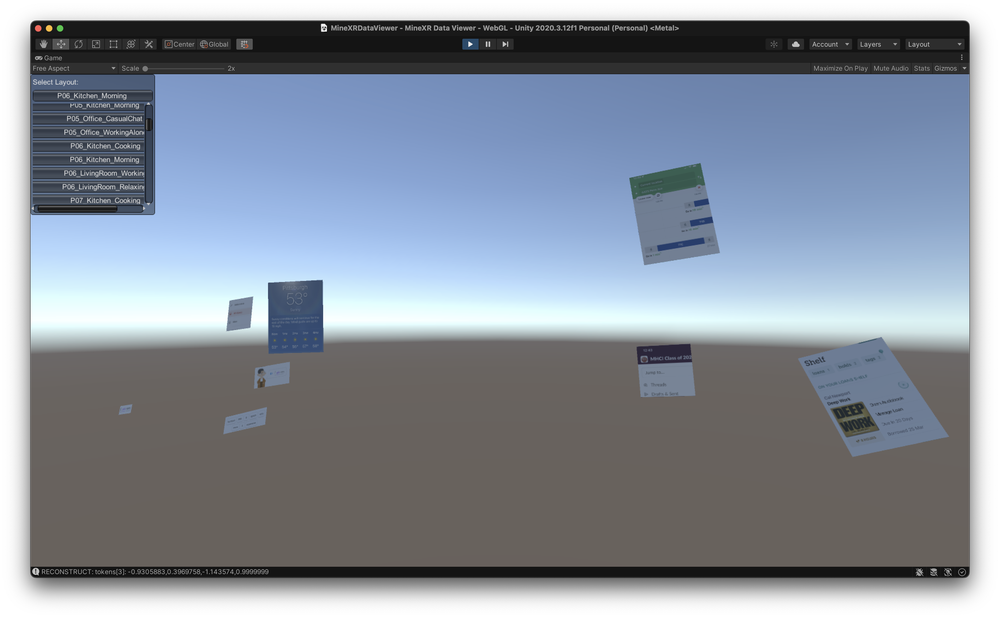

# MineXR Data Viewer

## How to use
1. Download Unity Editor version 2020.3.20.f1.
2. Download the [MinXR dataset zip file](https://drive.google.com/file/d/18NNp5OT3uRggXmFxgpxFju9abXWWeWo6/view?usp=sharing).
3. Clone the repository and open this directory in Unity Editor.
4. Move `widgets.csv`, `layouts.json`, and `screenshots_widgets/` under `Assets`. It might take a while to import all assets in Unity.
5. Press Run.
6. Use the dropdown on the top left corner to select a layout created by participants in different environments and tasks. 
7. Use the keyboard navigation (W - forward, A - left, S - backward, D - right, E - up , Q - down) to translate the camera. Hold down the right button of the mouse and move the mouse to rotate the camera view. 
8. (Optional) Use the room scans in the dataset (`room_scans`) to overlay the widgets on top of the room scan.
